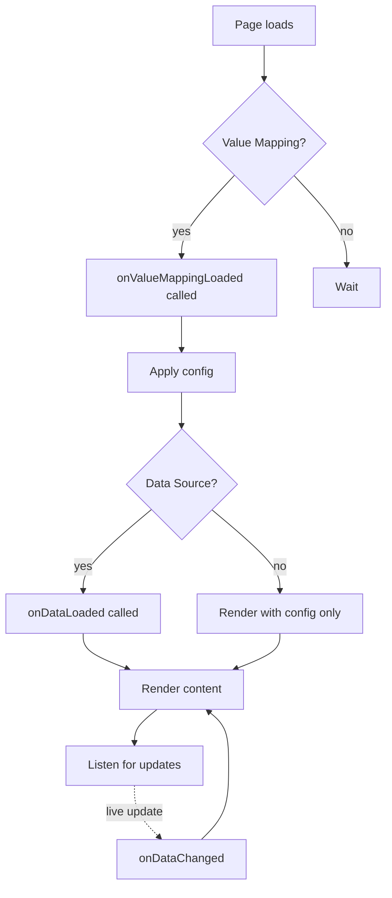
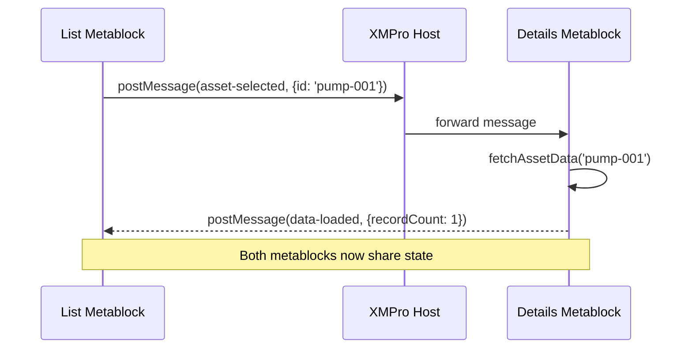
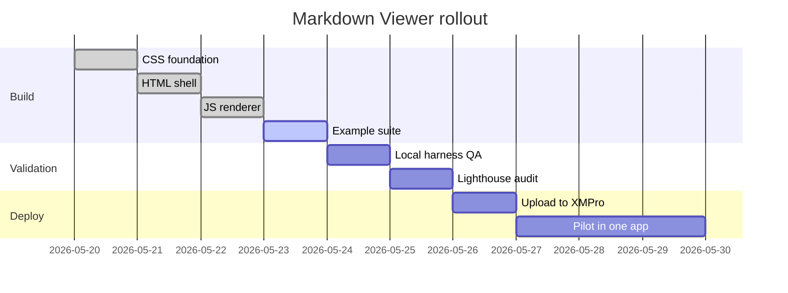
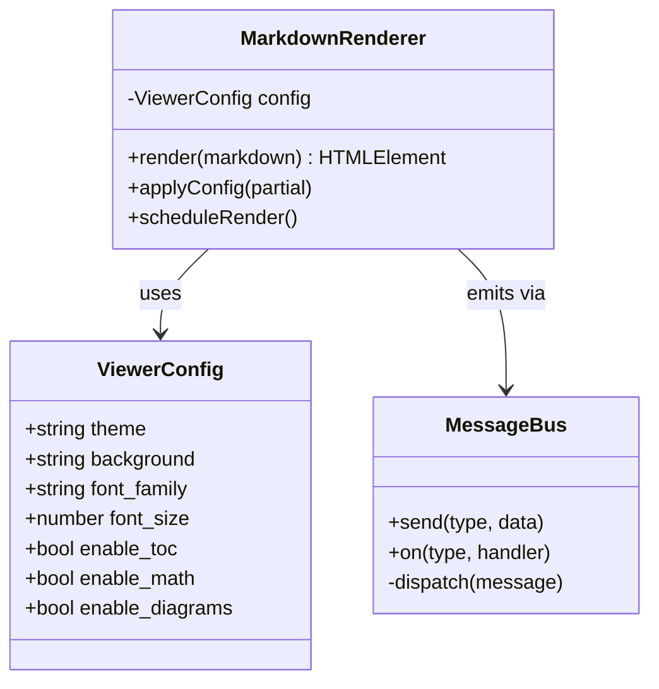
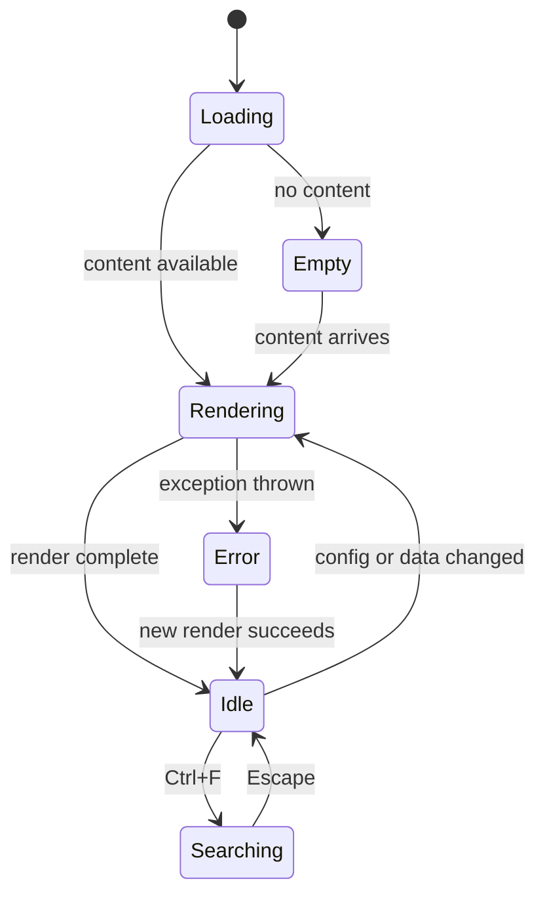
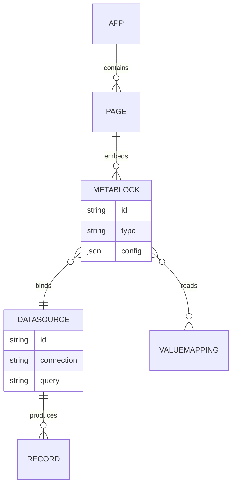
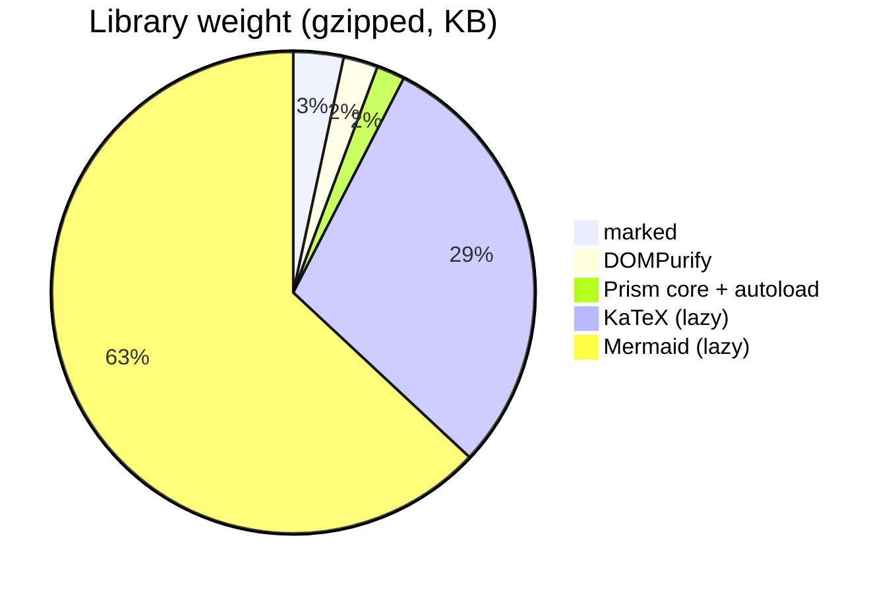

# Diagrams with Mermaid

This document exercises **Mermaid** diagrams. As with KaTeX, Mermaid only
loads when `enable_diagrams` is on **and** the content has at least one
```` ```mermaid ```` fenced block. Empty docs pay zero cost.

## Flowchart

A typical metablock initialization flow:



## Sequence

Two metablocks coordinating via `postMessage`:



## Gantt

A small project plan:



## Class diagram

The runtime types involved in rendering:



## State diagram

The metablock lifecycle as a finite state machine:



## ER diagram

If your metablock visualizes a relational schema:



## Pie chart



## Notes

> [!TIP]
> Mermaid respects the current viewer theme — it initializes with `theme: 'dark'`
> in dark mode and `'default'` in light mode. The viewer re-renders diagrams
> when you flip the theme so colors and contrast stay consistent.
