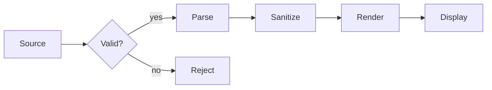

# Kitchen Sink

This document exercises **every feature** the viewer supports. Use it as a
regression check when changing the renderer. Turn on every toggle in the
toolbar (TOC, math, diagrams, anchors, progress bar, line numbers,
frontmatter display) to see the full surface area.

## Table of contents

The TOC at the side updates as you scroll. Each heading also has an anchor
link visible on hover — try hovering over this heading.

## Inline formatting

Body text with **bold**, *italic*, ***both***, ~~strikethrough~~, `inline
code`, [a link](https://xmpro.com), and a footnote.[^kitchen-fn] Keyboard
keys: <kbd>Ctrl</kbd>+<kbd>K</kbd>. Sub/sup: H<sub>2</sub>O, x<sup>2</sup>.
==Highlighted text== via `mark` tags.

## Unordered lists

- First level
  - Second level
    - Third level
      - Fourth level
- Items can contain **inline formatting**, `code`, and [links](https://example.com)
- Items can be paragraphs:

  This is a follow-up paragraph inside the same list item. Markdown
  recognizes the indentation and keeps everything together.

## Ordered lists

1. Items
2. Are numbered
3. Automatically
   1. Including
   2. Nested
   3. Lists

## Task lists

- [x] Implement renderer
- [x] Implement TOC
- [x] Implement search
- [ ] World domination

## Definition lists

GFM
: GitHub Flavored Markdown — the dialect most developers expect

KaTeX
: A fast math typesetting library. Renders to HTML+CSS, not raster images.

Mermaid
: A diagramming library that compiles text to SVG. Great for docs.

## Blockquotes

> A blockquote with **inline formatting**. The left border picks up the
> current theme's accent color.
>
> Multi-paragraph blockquotes work too. So does *italic*, `code`, and
> [links](https://example.com) inside.
>
> — *Someone, probably*

## Callouts (GitHub style)

> [!NOTE]
> This is a **note**. Use it for ambient context.

> [!TIP]
> This is a **tip**. Use it for recommendations.

> [!IMPORTANT]
> This is **important**. Use it for must-know information.

> [!WARNING]
> This is a **warning**. Use it for likely-trouble cases.

> [!CAUTION]
> This is a **caution**. Use it for genuine risk.

> [!DANGER]
> This is a **danger**. Use it sparingly.

## Code blocks

### JavaScript

```javascript
async function loadAndRender(url) {
    const response = await fetch(url);
    if (!response.ok) throw new Error(`HTTP ${response.status}`);
    const markdown = await response.text();
    return marked.parse(markdown);
}

// Usage
const html = await loadAndRender('https://example.com/doc.md');
document.getElementById('content').innerHTML = DOMPurify.sanitize(html);
```

### Python

```python
from dataclasses import dataclass
from typing import Optional

@dataclass
class Asset:
    id: str
    name: str
    temperature: float
    status: str = "normal"
    notes: Optional[str] = None

    def is_critical(self) -> bool:
        return self.temperature > 90.0 or self.status == "critical"

# Filter assets that need attention
assets = [Asset("p001", "Pump-001", 72.5), Asset("p002", "Pump-002", 94.3)]
critical = [a for a in assets if a.is_critical()]
```

### TypeScript

```typescript
interface MarkdownConfig {
    theme?: 'light' | 'dark' | 'auto';
    background?: BackgroundStyle;
    enable_toc?: boolean;
    enable_math?: boolean;
}

type BackgroundStyle =
    | 'solid' | 'gradient' | 'xmpro' | 'dots' | 'grid'
    | 'paper' | 'glass' | 'mesh' | 'aurora' | 'image' | 'none';

const defaults: MarkdownConfig = {
    theme: 'auto',
    background: 'solid',
    enable_toc: false,
    enable_math: false
};
```

### Bash

```bash
#!/usr/bin/env bash
set -euo pipefail

# Convert all .md files in this directory to a single combined HTML.
output="combined.html"
echo "<!DOCTYPE html><html><body>" > "$output"
for file in *.md; do
    echo "<!-- $file -->" >> "$output"
    pandoc "$file" >> "$output"
done
echo "</body></html>" >> "$output"
echo "Wrote $output ($(wc -l < "$output") lines)"
```

### JSON

```json
{
    "metablock_id": "kitchen-sink-demo",
    "theme": "auto",
    "background": "aurora",
    "enable_toc": true,
    "enable_math": true,
    "enable_diagrams": true,
    "accent_color": "#00d6ef"
}
```

### SQL

```sql
-- Find assets that breached temperature threshold in the last hour
SELECT
    a.id,
    a.name,
    a.location,
    t.peak_temperature,
    t.recorded_at
FROM assets a
INNER JOIN telemetry t ON t.asset_id = a.id
WHERE t.recorded_at >= NOW() - INTERVAL '1 hour'
  AND t.peak_temperature > a.threshold
ORDER BY t.recorded_at DESC;
```

### YAML

```yaml
metablock:
  type: markdown-viewer
  version: 1.0.0
  config:
    theme: auto
    background: gradient
    enable_toc: true
    toc_position: right
    enable_math: false
    accent_color: '#009fde'
```

## Tables

Basic alignment:

| Left aligned | Centered | Right aligned |
|:-------------|:--------:|--------------:|
| One | Two | Three |
| Four | Five | Six |
| Seven | Eight | Nine |

Realistic data table:

| Asset ID | Name | Temp (°C) | Status | Last seen |
|----------|------|----------:|--------|-----------|
| `p-001` | Main Pump | 72.5 | OK | 2s ago |
| `p-002` | Backup Pump | 94.3 | **Critical** | 1s ago |
| `p-003` | Auxiliary | 68.1 | OK | 3s ago |
| `p-004` | Coolant Pump | 81.7 | Warning | 1s ago |
| `p-005` | Reserve | 71.2 | OK | 4s ago |

## Math (requires enable_math)

Inline: $e^{i\pi} + 1 = 0$ and $\int_{-\infty}^{\infty} e^{-x^2} dx = \sqrt{\pi}$.

Display:

$$
\operatorname{Attention}(Q, K, V) = \operatorname{softmax}\!\left(\frac{Q K^\top}{\sqrt{d_k}}\right) V
$$

## Diagrams (requires enable_diagrams)



## Images


With a caption:

<figure>
  
  <figcaption>Click the image — if image zoom is enabled, it opens in a lightbox.</figcaption>
</figure>

## Horizontal rules

Above the line.

---

Below the line.

## Mixed content

Lists with code:

1. First, configure the metablock:

   ```javascript
   onValueMappingLoaded({ theme: 'dark', enable_toc: true });
   ```

2. Then, deliver content via Data Source:

   ```javascript
   onDataLoaded([{ markdown: '# Hello' }]);
   ```

3. Updates propagate automatically:

   ```javascript
   onDataChanged(newData, changes);
   ```

Tables inside callouts:

> [!IMPORTANT]
> Here is a critical configuration:
>
> | Setting | Required |
> |---------|----------|
> | `metablock_id` | Yes |
> | `content` or `markdown_url` | At least one |

## Footnotes

[^kitchen-fn]: Footnotes work the standard way — they collect at the bottom
and link back to their reference point. Try clicking this footnote number.

## End

If you can see this paragraph, you scrolled (or jumped) all the way down.
Congratulations on reading the kitchen sink — every feature passed through
your eyes.
